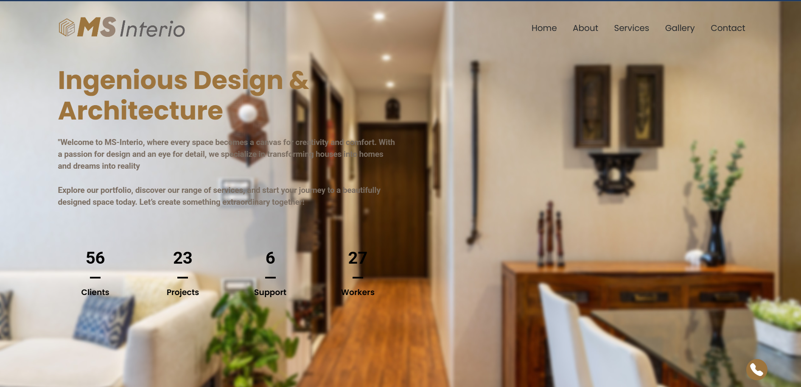
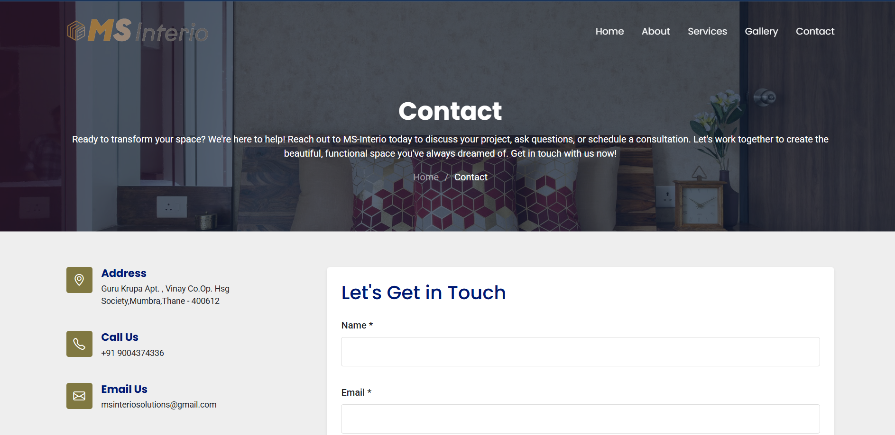

# MSInterio

<h2>📌 Overview</h2>

MSInterio is a modern, responsive website for an interior design firm, developed using <strong>HTML, Bootstrap, and jQuery</strong>. It showcases the firm's portfolio, services, and design expertise while ensuring a seamless user experience across all devices.

<h2>🌟 Live Website</h2>

<a href="https://msinterio.co">Visit MSInterio</a> 

<h2>🎯 Project Scope</h2>
<ul>
    <li>Display a portfolio of interior design projects.</li>
    <li>Provide an overview of services offered.</li>
    <li>Allow users to contact the firm through an integrated contact form.</li>
    <li>Offer a visually appealing and smooth browsing experience with animations.</li>
</ul>

<h2>✨ Features</h2>
<ul>
    <li>Fully Responsive - Developed with Bootstrap for optimal viewing on all devices.</li>
    <li>Interactive UI - Smooth animations and dynamic elements using jQuery.</li>
    <li>Portfolio Showcase - Elegant display of completed projects.</li>
    <li>Service Pages - Detailed breakdown of the services offered.</li>
    <li>Contact Form - Built-in form for inquiries and consultations.</li>
    <li>SEO Optimized - Proper HTML structuring for search engine visibility.</li>
    <li>Fast & Lightweight - Optimized assets for quick loading times.</li>
    <li>Social Media Integration - Links to Instagram, Pinterest, and other platforms.</li>
</ul>

<h2>🏗️ Tech Stack</h2>
<ul>
    <li><strong>Frontend:</strong> HTML, CSS, Bootstrap, jQuery</li>
    <li><strong>Animations:</strong> jQuery, AOS (Animate on Scroll)</li>
    <li><strong>Forms:</strong> PHP (for backend email handling, if applicable)</li>
    <li><strong>Hosting:</strong> Deployed on a live server</li>
</ul>

<h2>📸 Screenshots</h2>

<table>
    <tr>
        <td></td>
        <td></td>
    </tr>
    <tr>
        <td></td>
         <td></td>
    </tr>
    <tr>
        <td></td>
         <td></td>
    </tr>    
    <tr>
        <td></td>
         <td></td>
    </tr>
</table>
